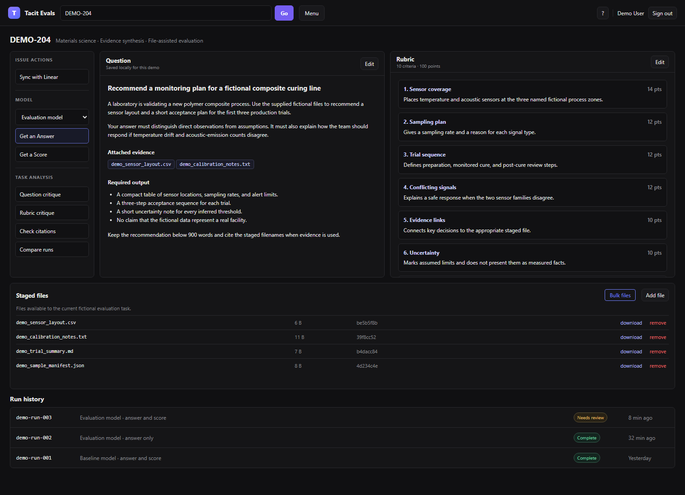
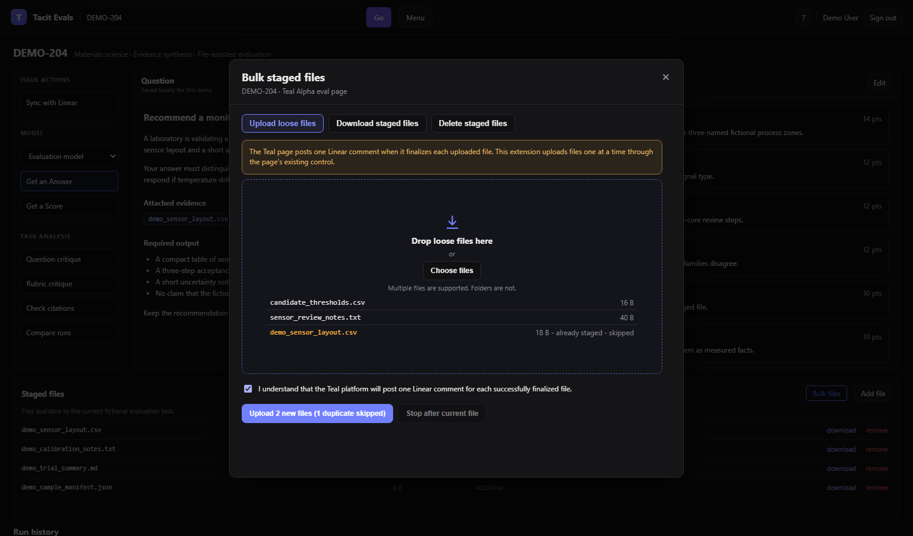

# Teal Eval Bulk Files

Teal Eval Bulk Files adds reliable batch file controls to Tacit Teal eval issue pages. It includes:

- a Chrome and Microsoft Edge extension for loose-file upload, one-ZIP download, and checked bulk deletion;
- a dependency-free Node 24 CLI for LLM and terminal workflows;
- a Codex skill that selects an open browser session and calls the CLI;
- a complete local-only demonstration page and repeatable screenshot tests.

Current release: `0.9.6`.



## Start a CLI batch

Use one plan for all requested files. Keep the returned `actionableFiles` as the approved filename and SHA-256 manifest. Apply its one-use token. Then run `list` and require exactly one staged row for each complete manifest filename and SHA-256 value.

```powershell
$plan = & .\skill\scripts\invoke-teal-cli.ps1 `
  -Browser edge -Issue DEMO-204 -Command plan-upload `
  -Files "C:\work\evidence.csv","C:\work\notes.txt" | ConvertFrom-Json

& .\skill\scripts\invoke-teal-cli.ps1 `
  -Browser edge -Issue DEMO-204 -Command apply-upload `
  -PlanToken $plan.token

& .\skill\scripts\invoke-teal-cli.ps1 `
  -Browser edge -Issue DEMO-204 -Command list
```

Use `verify` only when the local paths are the complete intended replacement set for all staged files. For a partial upload, use the plan manifest and a new `list` result.

## Main features

- Drag several loose files into one upload target.
- Skip duplicate filenames and continue with new files.
- Download selected staged files in one ZIP and use one Save As dialog.
- Select staged files with checkboxes before deletion.
- Stop an upload after the current file or stop a deletion during its five-second delay.
- Keep human Confirm/Cancel review inside the extension.
- Let an authorized CLI plan apply without the extension confirmation dialog. A CLI download still opens one native Save As dialog.
- Reject stale, mismatched, expired, ambiguous, or reused CLI plans.

## Install the extension

1. Clone or download this repository.
2. Open `chrome://extensions` in Chrome or `edge://extensions` in Microsoft Edge.
3. Enable **Developer mode**.
4. Select **Load unpacked**.
5. Select the repository's `extension` directory.
6. Reload the Teal issue page.

For update and troubleshooting steps, see [Browser installation](docs/browser-installation.md).

## Use the human interface

Open a Teal Alpha issue page and find **Staged files**. Select **Bulk files**, then select one mode:

- **Upload loose files**: drag files or use **Choose files**.
- **Download staged files**: select rows and create one ZIP.
- **Delete staged files**: select rows, review the exact names, and use the stop delay if needed.



See [Human interface guide](docs/human-interface.md) for all controls, duplicate rules, partial results, and stop behavior.

## Install the Codex skill

Copy the `skill` directory to the Codex skills directory and name it `teal-eval-bulk-cli`. On Windows, the usual destination is:

```text
%USERPROFILE%\.codex\skills\teal-eval-bulk-cli
```

If the skill is not kept beside the repository's `extension` directory, set `TEAL_EVAL_BULK_EXTENSION_ROOT` to the absolute extension path.

## Use the CLI

The CLI attaches to an already open browser session. It does not launch a browser, log in, or navigate. Select the exact browser or session first. The wrapper then requires exactly one transport: an explicit persistent stdio-proxy path, a current Chrome or Edge session, or an explicit loopback CDP endpoint.

The [Chrome DevTools MCP persistent bridge](https://github.com/esmaesx/chrome-devtools-mcp-persistent-bridge) is an optional transport for a user-selected Chrome session. It is in a separate repository. Keep its checkout separate from this repository, and pass the absolute path to its `runtime/stdio-proxy.mjs` file. The portable wrapper has no machine-specific default:

```powershell
& .\skill\scripts\invoke-teal-cli.ps1 `
  -PersistentBridgePath "<absolute-path-to-stdio-proxy.mjs>" `
  -Issue DEMO-204 -Command status
```

For direct current-session mode, enable the browser's protected local debugging bridge at `chrome://inspect/#remote-debugging` or `edge://inspect/#remote-debugging`. Then call the wrapper with the browser and exact issue ID:

```powershell
& .\skill\scripts\invoke-teal-cli.ps1 -Browser edge -Issue DEMO-204 -Command status
& .\skill\scripts\invoke-teal-cli.ps1 -Browser edge -Issue DEMO-204 -Command list
```

Uploads, downloads, and deletions use two commands. `plan-*` returns a one-use token. `apply-*` rechecks the exact plan before it starts. The user's requested plan is the CLI approval boundary. No extension confirmation click is required for the CLI path. Human-interface batches still use their Confirm/Cancel controls.

Use persistent mode for work with several commands. Direct browser and CDP calls remain available, but they can cause a local browser permission prompt.

If more than one allowed tab matches the issue, the CLI stops. It does not select one by itself. Use `--target-id` in the CLI or `-TargetId` in the PowerShell wrapper with a listed allowed target ID.

`list`, every `plan-*` command, and `verify` require a present staged-files panel that is not loading. A present ready panel with no rows is a valid empty inventory. A missing or loading panel is an observation failure. Each plan selects rows and records inventory from one strict refreshed observation.

`plan-upload` is read-only. It validates absolute regular local files, streams their size and SHA-256 values, lists staged files, classifies repeated or already staged names, and writes a local version-2 one-use token. It does not transfer a file handle. `apply-upload` rechecks the issue, target, page, inventory, and each local name, size, and SHA-256 value. It makes a private verified snapshot of the approved bytes. It then claims and consumes the token atomically before it transfers only the snapshot, obtains authorization, and applies the upload. A later change to the original path cannot change the bytes that Chrome receives. Before each native upload dispatch, the extension waits for a ready panel and checks the exact filename again. If the filename became staged, the extension records a proved skip and sends no upload for that file.

After upload apply, run `list`. Compare it with `actionableFiles`. Require one exact complete filename and SHA-256 match for each manifest item.

After an upload transfer error without a proved terminal result, treat the result as `indeterminate`. Do not retry. Run `status` and `list`, then review `uploadedBeforeFailure` with the operator before any new plan. A proved stopped or partial result with non-empty `remaining` exits `4`.

For a download, pass exact staged filenames to `plan-download`, then pass only its token to `apply-download`:

```powershell
& .\skill\scripts\invoke-teal-cli.ps1 `
  -Browser edge -Issue DEMO-204 -Command plan-download `
  -Operands "evidence.csv","notes.txt"

& .\skill\scripts\invoke-teal-cli.ps1 `
  -Browser edge -Issue DEMO-204 -Command apply-download `
  -Operands "<one-use-token>"
```

Apply creates one verified ZIP and opens exactly one native Save As dialog. The CLI does not accept an arbitrary absolute output path.


See [CLI guide](docs/cli-guide.md) for browser selection, every command, JSON fields, and failure recovery.

`verify <absolute paths...>` is read-only and is only for a complete intended replacement set. It compares local SHA-256 values with all staged inventory and reports `matched`, `mismatched`, `missingRemotely`, and `missingLocally`. A difference returns exit code `4`.

## Safety model

- The production extension runs only on `https://platform-teal-alpha.vercel.app/issue/*`.
- The CLI accepts only an explicit local persistent-bridge path, a selected current browser session, or an explicit loopback debugging endpoint.
- The CLI reads no cookies, passwords, browser history, or credential databases.
- Upload, download, and delete plans are bound to the exact issue, target tab, URL, page title, page generation, connection mode, requested names, and staged inventory.
- Human upload and delete actions keep the extension's closed-shadow confirmation dialog. Human download uses the native Save As dialog.
- CLI actions require the exact requested plan and two one-use authorization layers.
- Local state updates use an exclusive lock and atomic replacement. Every apply claims its token before transfer or dispatch, so parallel processes cannot use one token twice. A successful parallel plan write cannot silently lose another token.
- Upload apply transfers a private snapshot that is bound to the planned filename, size, and SHA-256 value. Its per-user root has an owner-only Windows DACL or POSIX mode. The store checks exact root containment and rejects reparse points. It uses bounded `building`, `transferring`, and `browser_active` states. The extension has a two-hour total upload deadline. The browser-active snapshot lifetime is 150 minutes. A proved terminal result removes the snapshot. An uncertain result starts a bounded cleaner. A later CLI start removes only an exact expired snapshot. It leaves active or ambiguous data unchanged and reports a cleanup warning without making apply retryable.
- Every CLI JSON object includes `exitCode` and `exitMeaning`.
- Delete plans include `actionableFiles` records with filename, SHA-256, and size. Before a new delete plan, the skill offers and recommends a separate exact-name download backup plan and apply. A cancelled or uncertain backup blocks deletion unless the user explicitly declines the backup.
- Delete apply reports `inventoryBefore`, `inventoryAfter`, and an `inventory` alias for the after state. If after-state observation fails, run a read-only `list` and do not replay the consumed apply.
- Never click a page's native **remove** control. Ask the human operator to use it for an ambiguous duplicate row.
- For persistent transport recovery, run `status.ps1` first. `backend_connected: true` does not prove that the browser lease is free. Start the daemon only when status confirms `daemon_absent` and local authority permits the start. A real proxy startup record with cause `daemon_absent` keeps that classification. Ambiguous output is `proxy_lifecycle`. For `lease_busy`, preserve an authenticated owner PID. Keep `held_unknown` unknown. Never expose owner command lines, tokens, or page data. Check the exact owner and liveness. Do not kill or restart a process by count or age.
- Real Teal issues are never used for mutation tests.

Local browser debugging is trusted local mutation authority. The plan controls prevent accidental or stale applies. They cannot protect a debugging session from another hostile local process that already controls it.

The current interface already shows SHA-256 prefixes in delete review and per-file progress. Version 0.9.6 has no visual interface change.

## Documentation

- [Browser installation and update](docs/browser-installation.md)
- [Human interface](docs/human-interface.md)
- [CLI and Codex skill](docs/cli-guide.md)
- [Local demonstration and screenshot reproduction](docs/local-demo.md)
- [Extension implementation details](extension/README.md)
- [CLI contract](skill/references/cli-contract.md)

## Tests

Requirements: Node 24 and Python 3. Screenshot capture also needs Playwright's Chromium browser. The default test suite is portable. It validates PowerShell wrapper source on every platform and validates wrapper process behavior on Windows PowerShell 5.1.

```powershell
npm install
npm test
npm run test:manifest
npm run docs:verify
npm run test:delete-observation-browser
```

The delete-observation browser test uses only the fictional local issue, a temporary extension copy, and a temporary Chromium profile. The cross-repository bridge suite is optional and stays outside `npm test`. Set `TEAL_PERSISTENT_BRIDGE_SOURCE_ROOT` to the absolute local bridge source directory, then run `npm run test:bridge-integration`. If the variable and the reviewed sibling source are both absent, that suite skips.

The complete demonstration and screenshot workflow is in [Local demonstration and screenshot reproduction](docs/local-demo.md).

## License

No license is included. The repository is public, but no reuse license has been granted.
