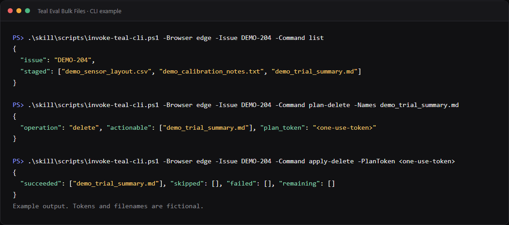

# CLI and Codex skill guide

The CLI lets a terminal, Codex, Claude, or another local agent manage staged files without visual page navigation. It attaches only to an already open allowed issue tab.



## Start with a batch

Use one plan for all requested files. The wrapper accepts `-Files`, `-Paths`, and `-Names` as aliases for operands. It accepts `-PlanToken` for an apply token.

```powershell
$plan = & .\skill\scripts\invoke-teal-cli.ps1 `
  -Browser edge -Issue DEMO-204 -Command plan-upload `
  -Files "C:\work\new-evidence.csv","C:\work\notes.txt" | ConvertFrom-Json

$plan.actionableFiles

& .\skill\scripts\invoke-teal-cli.ps1 `
  -Browser edge -Issue DEMO-204 -Command apply-upload `
  -PlanToken $plan.token

$after = & .\skill\scripts\invoke-teal-cli.ps1 `
  -Browser edge -Issue DEMO-204 -Command list | ConvertFrom-Json
```

Keep `actionableFiles` as the approved manifest. After apply, run `list`. For each manifest item, require exactly one row with the same complete filename and SHA-256 value. A missing, changed, or repeated row is a failure. Use `verify` only when the local paths are the complete intended replacement set for all staged files.

## Requirements

- Node.js 24
- Teal Eval Bulk Files `0.9.7` loaded unpacked in Chrome or Microsoft Edge
- Chrome DevTools MCP persistent bridge `0.1.2` for persistent mode
- An open Teal Alpha issue tab
- The selected browser's protected local debugging bridge enabled

The CLI does not launch a browser, open a tab, navigate, log in, or read cookies and passwords.

## Select a browser session

If the user names Chrome, Edge, a profile, a session, or the current browser, use that exact choice. Do not silently use another browser.

For Chrome, open `chrome://inspect/#remote-debugging`. For Edge, open `edge://inspect/#remote-debugging`. Enable remote debugging for the current session. The browser can ask the user to approve one local connection.

Inspect available sessions when no session was named:

```powershell
& .\skill\scripts\inspect-browser-sessions.ps1
```

Then ask which listed session to use. The CLI must find exactly one open tab for the requested issue.

After the user selects the session, use exactly one wrapper transport:

- `-PersistentBridgePath <absolute-path>` for a selected Chrome session with a configured compatible stdio proxy
- `-Browser chrome|edge` for direct current-session mode
- `-CdpEndpoint <loopback-URL>` for an explicit loopback CDP endpoint

The [Chrome DevTools MCP persistent bridge](https://github.com/esmaesx/chrome-devtools-mcp-persistent-bridge) provides the optional persistent Chrome transport. It is in a separate repository. Keep its checkout separate from this repository, and pass the absolute path to its `runtime/stdio-proxy.mjs` file. Teal validates the MCP server name and exact bridge version before a browser tool can run.

The portable wrapper has no default persistent path. The presence of a proxy does not select a browser session. Use persistent mode for work with several commands. Direct mode can cause a local browser permission prompt.

If more than one allowed tab matches the issue, the CLI stops and reports only safe target IDs and titles. It never selects one by itself. Use `--target-id <listed-id>` or wrapper `-TargetId <listed-id>` to select one exact allowed tab.

## Read-only commands

For a user-selected session through a configured persistent bridge:

```powershell
& .\skill\scripts\invoke-teal-cli.ps1 `
  -PersistentBridgePath "<absolute-path-to-stdio-proxy.mjs>" `
  -BridgeWaitSeconds 120 `
  -Issue DEMO-204 -Command status
```

The persistent wait defaults to 120 seconds. The wrapper `-BridgeWaitSeconds` and CLI `--bridge-wait-seconds` accept only a canonical integer from 1 through 300. Do not use this option with direct browser or CDP mode. The wait is before Chrome dispatch. Only `list_pages` receives the wait plus its normal 45-second timeout. The same proxy session and lease then run `select_page` and one target tool. Configured Codex gateways keep their fail-fast defaults.

For direct current-session mode:

```powershell
& .\skill\scripts\invoke-teal-cli.ps1 -Browser edge -Issue DEMO-204 -Command status
& .\skill\scripts\invoke-teal-cli.ps1 -Browser edge -Issue DEMO-204 -Command list
```

`status` reports extension readiness and the active operation. `list` returns the sorted staged-file inventory. `list`, all three plan commands, and `verify` require a present staged-files panel that is not loading. A present ready panel with no rows is a valid empty inventory. A missing or loading panel is an observation failure. Each plan selects its rows and records its inventory from one strict refreshed observation.

`verify` is also read-only. Use it only for a complete intended replacement set. It needs absolute local file paths and compares the complete local set with all staged inventory. For a partial upload, compare the plan's `actionableFiles` with a new `list` result instead.

```powershell
& .\skill\scripts\invoke-teal-cli.ps1 `
  -PersistentBridgePath "<absolute-path-to-stdio-proxy.mjs>" `
  -Issue DEMO-204 -Command verify `
  -Operands "C:\work\evidence.csv"
```

It reports `matched`, `mismatched`, `missingRemotely`, and `missingLocally`. Exit `4` means that the exact sets do not match.

An explicit loopback endpoint can be used instead of current-session mode:

```powershell
& .\skill\scripts\invoke-teal-cli.ps1 -CdpEndpoint "http://127.0.0.1:9222" -Issue DEMO-204 -Command list
```

## Upload with a two-phase plan

```powershell
& .\skill\scripts\invoke-teal-cli.ps1 `
  -Browser edge -Issue DEMO-204 -Command plan-upload `
  -Operands "C:\work\new-evidence.csv","C:\work\notes.txt"
```

`plan-upload` is read-only. It accepts only absolute safe regular file paths. It streams each local size and SHA-256 value, lists staged inventory, and classifies repeated requested names and already staged names. It creates a local version-2 one-use token. It does not transfer a file handle and does not ask the extension for upload authorization.

Show the returned `actionableNames`, `actionableFiles`, and `skipped` values. Keep the complete filename and SHA-256 values in `actionableFiles` as the post-apply check manifest. If the user requested that exact upload, apply the returned one-use token:

```powershell
& .\skill\scripts\invoke-teal-cli.ps1 `
  -Browser edge -Issue DEMO-204 -Command apply-upload `
  -Operands "<one-use-token>"
```

`apply-upload` rechecks the exact issue, target, URL, page, staged inventory, and local name, size, and SHA-256 values. It copies the approved bytes to a private per-apply snapshot and verifies the snapshot against the planned name, size, and SHA-256 value. It then claims and consumes the local token with an exclusive local state lock before one file transfer. Chrome receives the verified snapshot path, so a later change to the original path cannot change the upload bytes. Before each native upload dispatch, the extension waits for a ready panel and checks the exact filename again. If the filename became staged, it records a proved skip and sends no upload for that file. The human interface keeps its Confirm/Cancel controls; the CLI does not click them.

The snapshot root is private to the current user. The store verifies an owner-only Windows DACL or POSIX mode, exact root containment, metadata, nonce, deadlines, and no reparse point. Construction has a bounded `building` deadline. Each file-selection call renews a bounded `transferring` lease. After all transfers, the store enters `browser_active` before authorization and keeps the verified bytes for 150 minutes. The content upload batch has a two-hour total deadline. A proved terminal result removes the snapshot. On uncertainty, a bounded cleaner keeps it through the possible browser lifetime. A later CLI start removes only an exact expired snapshot. It does not remove an active or ambiguous directory. A cleaner start or delete failure adds a structured warning. It does not permit an apply retry.

After apply, run `list`. Require one exact filename and SHA-256 match for every `actionableFiles` item.

An error after transfer without a proved terminal result is `indeterminate`. Do not retry. Run `status` and `list`, then review `uploadedBeforeFailure` with the operator before any new plan. A proved stop or partial result has complete terminal arrays and exits `4`. It is not indeterminate unless the result says that its state is uncertain.

## Download with a two-phase plan

Pass exact staged filenames. Do not pass an output path.

```powershell
& .\skill\scripts\invoke-teal-cli.ps1 `
  -Browser edge -Issue DEMO-204 -Command plan-download `
  -Operands "evidence.csv","notes.txt"
```

Show the returned actionable and skipped names. If the user requested that exact download, apply the returned one-use token:

```powershell
& .\skill\scripts\invoke-teal-cli.ps1 `
  -Browser edge -Issue DEMO-204 -Command apply-download `
  -Operands "<one-use-token>"
```

Apply rechecks the exact issue, tab, URL, page title, page generation, connection mode, and staged inventory. It creates one verified ZIP and opens exactly one native Save As dialog. The user chooses the destination there. The CLI does not accept an arbitrary absolute output path, and it does not open the extension Confirm/Cancel dialog.

## Delete with a two-phase plan

```powershell
& .\skill\scripts\invoke-teal-cli.ps1 `
  -Browser edge -Issue DEMO-204 -Command plan-delete `
  -Operands "old-evidence.csv","old-notes.txt"
```

Show the exact actionable names. Apply only the matching user-requested plan:

```powershell
& .\skill\scripts\invoke-teal-cli.ps1 `
  -Browser edge -Issue DEMO-204 -Command apply-delete `
  -Operands "<one-use-token>"
```

The five-second stop delay starts when apply begins.

The plan result includes `actionableFiles`. Each item has an exact filename, SHA-256 value, and size. Before a fresh delete plan, offer and recommend a separate exact-name `plan-download` and `apply-download` backup. If the backup is cancelled or uncertain, do not delete unless the user explicitly declines that backup.

Never click the page's native **remove** control. If duplicate rows are ambiguous, ask the human operator to use that native control.

## Stop

```powershell
& .\skill\scripts\invoke-teal-cli.ps1 -Browser edge -Issue DEMO-204 -Command stop
```

Use `stop` immediately when the user asks. Do not create another plan first.

## Result fields

Every command writes one JSON object to stdout. Apply results report these arrays separately:

- `succeeded`: completed names
- `skipped`: duplicates, missing names, or other safe skips
- `failed`: names that reported an operation failure
- `remaining`: names not started or not completed

Every JSON object also has `exitCode` and `exitMeaning`. They match the process exit code and its meaning.

Download results also return:

- `archiveFilename`: the generated ZIP filename
- `downloadId`: the identifier returned for the ZIP download

Delete apply requires a present staged-files panel that is not loading for both inventory observations. A present panel with no rows is a valid empty inventory. A missing or loading panel before delete causes zero delete dispatch. Delete apply results return `inventoryBefore`, `inventoryAfter`, and `inventory`. The `inventory` field is an alias for `inventoryAfter`. If post-operation observation fails, both after fields are null, the terminal arrays remain, the result is indeterminate, and `inventoryObservationError` tells you to run a read-only `list`. Do not replay the apply.

Exit codes are:

- `0`: completed without a reported failure or cancellation
- `2`: usage or argument failure
- `3`: persistent-bridge, browser-session, or debugging connection failure
- `4`: operation, plan, inventory, cancellation, or extension failure

## Failure recovery

Do not retry an uncertain `apply-upload`, `apply-download`, or `apply-delete`. A timeout, closed transport, direct bridge exception after dispatch, `indeterminate: true`, or missing final JSON makes the result uncertain. Every apply claims and consumes its token atomically before transfer or operation dispatch. Parallel processes cannot use the same token twice. A concurrent local state lock fails closed; do not remove an invalid or stale lock without strict owner, liveness, and time proof.

1. Run `status`.
2. Run `list`.
3. Compare the current staged inventory with the requested operation.
4. For an uncertain download, do not infer whether Save As completed from the staged inventory.
5. Report succeeded, skipped, failed, remaining, and any uncertainty.
6. Create a new plan only with fresh user authority. Never replay the consumed apply token.

For an upload error after transfer, also review `uploadedBeforeFailure`. Do not infer success from this field. It is an observed exact name and SHA-256 match only.

## Persistent daemon preflight

The `runtime` folder contains the selected `stdio-proxy.mjs` file. Use this recovery order:

1. Run `runtime\status.ps1`.
2. Read `errorKind`. The stable values are `daemon_absent`, `lease_busy`, `daemon_timeout`, `proxy_lifecycle`, `rpc_error`, `no_matching_tab`, and `generic_bridge_error`.
3. Do not use `backend_connected: true` as proof that the browser lease is free.
4. Run `runtime\start-daemon.ps1` only when status confirms `daemon_absent` and local authority permits the start.
5. For `lease_busy`, use an authenticated `owner_pid` when the result has one. Do not report that known owner as unknown. A queue timeout has `dispatched: false`, exits `3`, and does not permit automatic confirmation, resend, or apply replay. For `held_unknown`, or when no authenticated PID exists, report that the owner is unknown. Do not print owner command lines, tokens, or page data. Check the exact owner and liveness. Do not kill or restart a process by count or age.
6. For an uncertain apply, run read-only `status` and `list`. Do not retry, kill, or restart as a response to that apply.
7. Run a new command only after the operator confirms the transport state.

The CLI recognizes `daemon_absent` only from the real proxy's bounded, exact startup-failure record or an authenticated structured bridge result. Malformed or ambiguous child output stays `proxy_lifecycle`. The CLI does not start the daemon and does not retry a failed command automatically.

Never print browser WebSocket paths, extension authorization IDs, cookies, or unrelated tab URLs.

The current human interface already shows SHA-256 prefixes in delete review and per-file progress during batch work. Version 0.9.7 has no visual interface change.
