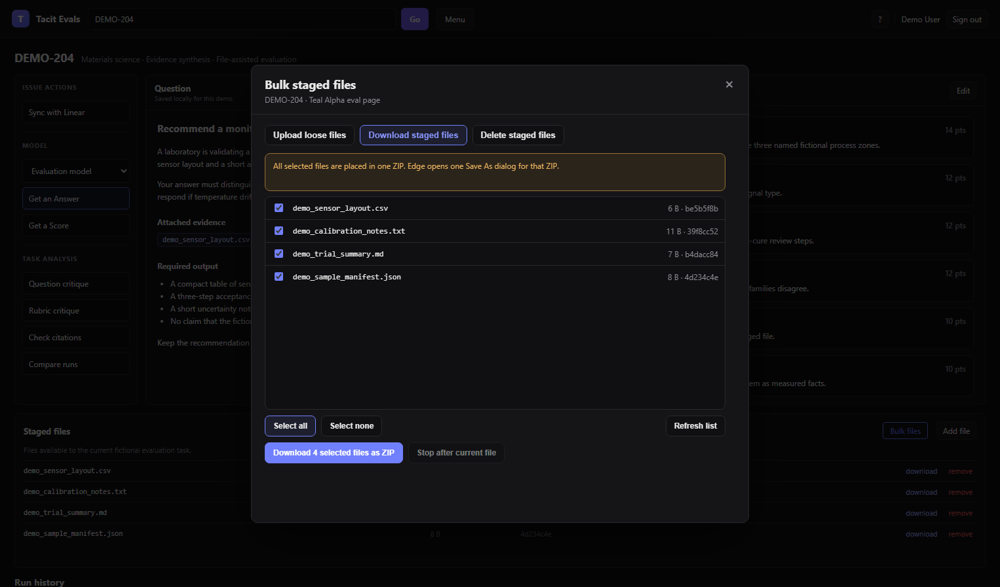
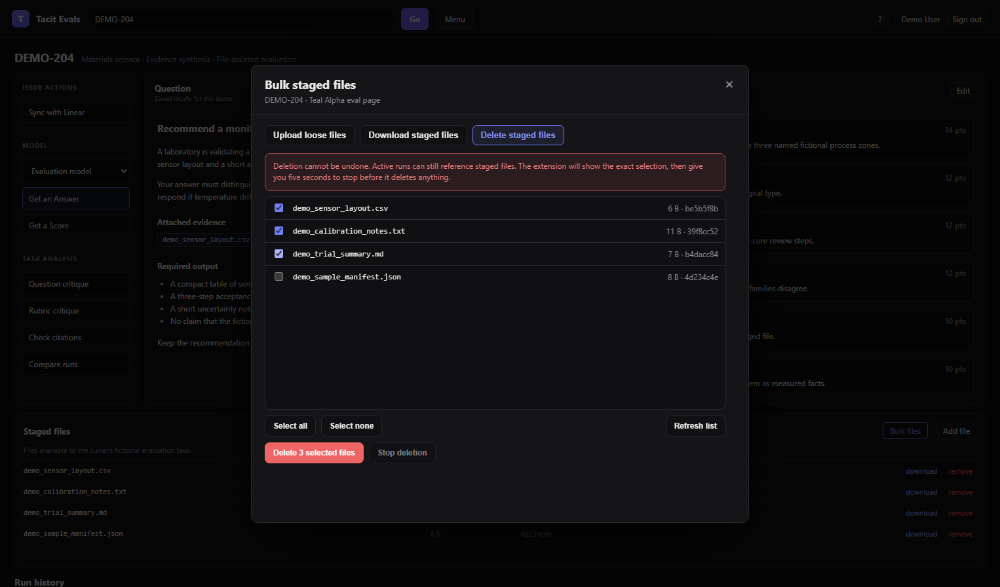

# Human interface guide

Open a Teal Alpha issue page. In the **Staged files** card, select **Bulk files**. The extension opens one fixed-size dialog. The mode buttons and file area stay in the same position when the mode changes.

## Upload loose files

1. Select **Upload loose files**.
2. Drag loose files into the large target or select **Choose files**.
3. Review every filename inside the target.
4. Select the Linear-comment acknowledgement.
5. Select the upload button.
6. Review the exact selection in the extension confirmation and select **Confirm**.

The Teal platform posts one Linear comment when it finalizes each uploaded file. The extension uploads one file at a time through the page's existing control.

### Duplicate handling

- A filename that is already staged is marked as a duplicate and skipped.
- If the same new filename is selected more than once, only the first copy is uploaded.
- Duplicate files do not stop other new files.
- A file that becomes staged after selection is skipped when its turn begins.

### Stop and retry

Select **Stop after current file** to let the active upload finish and keep later files selected. If Teal reports an error, the extension stops and keeps the failed and unstarted files selected for a manual retry.

## Download staged files

1. Select **Download staged files**.
2. Select individual rows or use **Select all**.
3. Select **Download selected files as ZIP**.
4. Choose one location in the browser's Save As dialog.

The extension checks the current staged-file API, reads each selected file, and builds one uncompressed ZIP in the browser. One batch creates one ZIP and one Save As dialog.

If Save As is cancelled or a source file cannot be read, no partial ZIP is saved. The selected rows remain selected for retry.

Rows with the same filename and SHA-256 value are marked as ambiguous. Use the page's native control for those rows.

## Delete staged files

1. Select **Delete staged files**.
2. Select individual rows or use **Select all**.
3. Select **Delete selected files**.
4. Review the exact filenames and SHA-256 prefixes.
5. Select **Confirm**.

Deletion cannot be undone. The extension gives a five-second stop delay before the first deletion.

- Select **Stop deletion** during the delay to delete nothing.
- Select it after deletion starts to finish only the current file.
- Any later selected files remain selected.
- The extension rereads the page after every deletion because the staged-file list changes.
- It stops if it cannot prove the exact next row.

## Human and CLI confirmation rules

Human upload and delete actions use the extension's Confirm/Cancel dialog. Human download uses the selected rows and one native Save As dialog.

CLI actions use a separate path: the exact user request, a one-use plan token, a one-use extension authorization, and a fresh identity and inventory check. A valid CLI apply does not open or click the extension confirmation dialog. CLI download creates one verified ZIP and opens exactly one native Save As dialog. It does not accept an arbitrary absolute output path.
